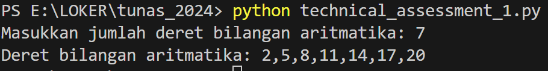

# Technical Assessment 1
Repository ini merupakan jawaban dari Technical Assessment 1

## Requirements used
1. Python 3.10.11

## Installation
1. Move to the directory where you would like to perform the installation
2. run command: "git clone https://github.com/friliansa/technical_assessment_1 custom_name_directory" (clone this repo)
3. run command: "cd custom_name_directory" (move to repo directory)
4. run command: On Windows: "python technical_assessment_1.py" | On Linux/macOS: "python3 technical_assessment_1.py" (run python program)
5. Input N (banyak bilangan)
6. Output N bilangan deret aritmatika dengan suku ke-1: 2 dan selisih antar suku: 3

## Result Screenshot

