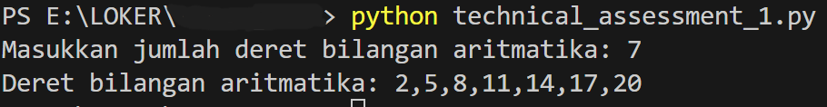

# Technical Assessment 1
Repository ini merupakan jawaban dari TECHNICAL ASSESSMENT 1

## Requirements used
Python 3.10.11

## Installation
1. git clone https://github.com/friliansa/technical_assessment_1 custom_name_directory
2. cd custom_name_directory
3. python technical_assessment_1.py
4. Input N (banyak bilangan)
5. Output N bilangan deret aritmatika dengan suku ke-1: 2 dan selisih antar suku: 3

## Screenshot

